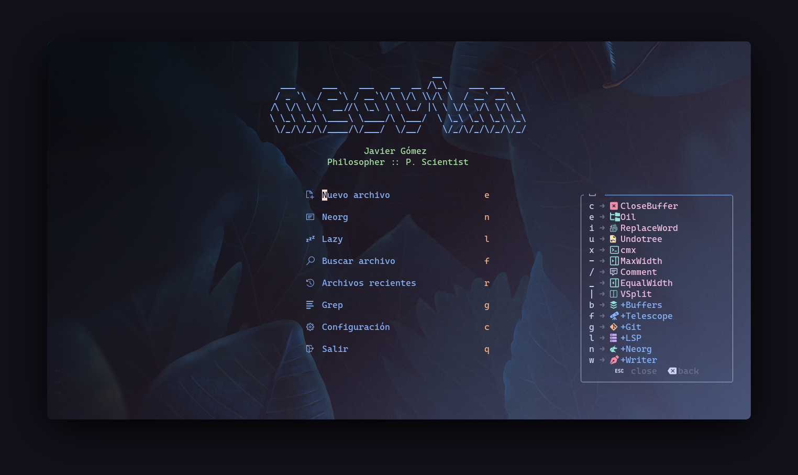

https://www.youtube.com/watch?v=vkUawbib7ng

# xNVIMx

## Dots Neovim + Scripts

Esta es mi configuración de <a href="https://github.com/neovim/neovim"
target="_blank">Neovim</a> y algunos scripts para hacer más fluido mi trabajo
con LaTeX, Typst y Pandoc.

No está configurado para uso exclusivo de escritura, sino también para
desarrollo web. Ya que sigo el estilo de configuración de <a
href="https://github.com/ChristianChiarulli/nvim" target="_blank">chris@machine</a>, es
muy fácil desactivar o eliminar plugins desde el init.lua

## Dependencias

> WARNING: Uso ArchLinux con Hyprland, por lo que algunas dependencias pueden
> variar entre Wayland y Xorg.
> <a href="https://github.com/frvnzj/dotfiles" target="_blank">Mis dotfiles</a>.


### Neovim

Uso la compilación <a
href="https://github.com/neovim/neovim/blob/master/BUILD.md"
target="_blank">RelWithDebInfo</a> (recomendable), pero se puede instalar con cualquier
packermanager. En ArchLinux:

```bash
sudo pacman -S neovim
```


### xNVIMx

Esta configuración cuenta con los siguientes plugins:

- <a href="https://github.com/folke/lazy.nvim" target="_blank">Lazy</a>
- <a href="https://github.com/catppuccin/nvim" target="_blank">Catppuccin</a>
- <a href="https://github.com/williamboman/mason.nvim" target="_blank">Mason</a>
- <a href="https://github.com/nvim-lualine/lualine.nvim" target="_blank">Lualine</a>
- <a href="https://github.com/nvim-neo-tree/neo-tree.nvim" target="_blank">Neo-tree</a>
- <a href="https://github.com/nvim-telescope/telescope.nvim" target="_blank">Telescope</a>
- <a href="https://github.com/neovim/nvim-lspconfig" target="_blank">Nvim-lspconfig</a>
- <a href="https://github.com/nvim-neorg/neorg" target="_blank">Neorg</a>
- <a href="https://github.com/Zeioth/markmap.nvim" target="_blank">Markmap</a>
- <a href="https://github.com/toppair/peek.nvim" target="_blank">Peek</a>
- y más...

Algunos plugins como Mason dependen de otros paquetes como npm:

```bash
sudo pacman -S npm deno yarn
```

Para instalar esta configuración se requiere de **git**.

```bash
# En Arch
sudo pacman -S git
```

Ingresa al directorio que desees, por ejemplo Descargas, y copia este
repositorio (sin permisos de super usuario):

```bash
git clone https://codeberg.org/frvnzj/xnvimx.git
```

Ingresa a la carpeta clonada y copia la carpeta nvim a **~/.config** . Abre
nvim y automáticamente se instalarán todos los plugins.

```
cd xnvimx
cp -rf nvim/.config/nvim ~/.config

# o con stow
stow -vt ~ nvim
```


### Scripts

Los scripts dentro de la carpeta con el mismo nombre tienen que copiarse al
directorio **~/.local/bin**

Las dependencias para hacer uso de estos scripts son:

```bash
sudo pacman -S curl fd rg grep bat sed awk zathura zathura-pdf-poppler
```

```bash
# En wayland
sudo pacman -S bemenu fuzzel wtype wl-clipboard

# En xorg se recomienda
sudo pacman -S dmenu rofi xdotool xorg-xclipboard
```

### Term

La terminal es opcional. Yo uso <a href="https://github.com/wez/wezterm" target="_blank">WezTerm</a>.


## LaTeX y Pandoc

La mejor forma de instalar LaTex (TeX Live) es siguiendo la <a href="https://tug.org/texlive/doc/texlive-en/texlive-en.html#installation" target="_blank">documentación</a> del TeX User Group. También se encuentra la versión de la documentación de <a href="https://tug.org/texlive/doc/texlive-es/texlive-es.html#instalación" target="_blank">instalación</a> en español.

Se recomienda el uso de <a href="https://github.com/Morganamilo/paru"
target="_blank">Paru</a> para el manejo de los Arch User Repository, donde se encuentra Pandoc en la versión sin dependencias.

```bash
# Sin permisos de superusuario
paru -S pandoc-bin
```
